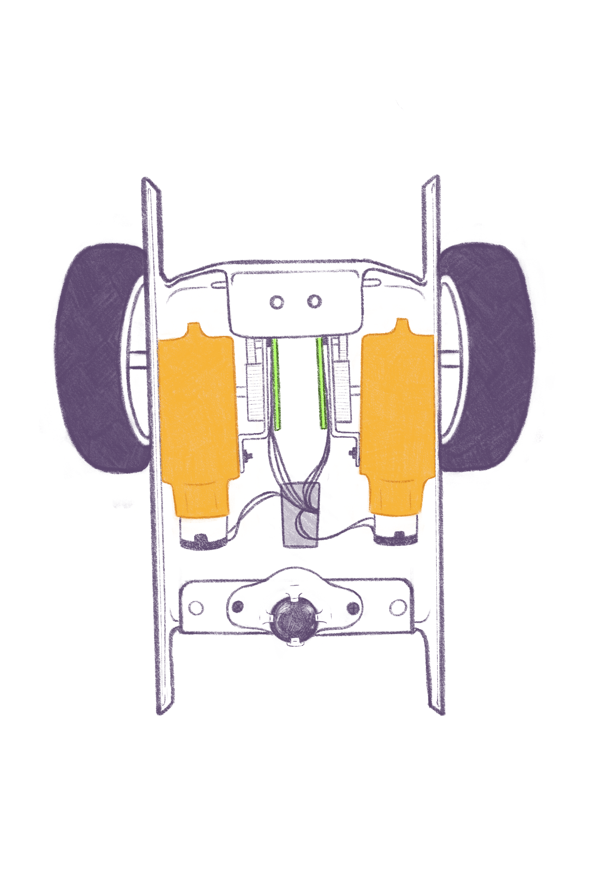
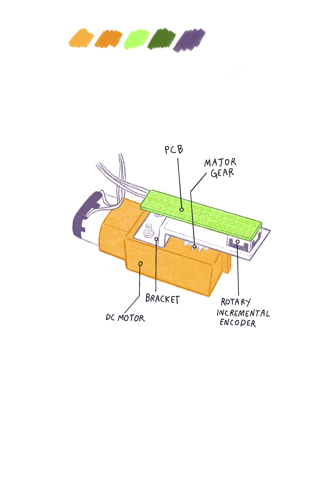

# Autonomous-Maze-Solving-Robot
This is a robot that can find the best path for a 5x5 maze, detect obstacles, and reroute. I built this with 3 other engineers! I built the original model of the car (the basic electromechanical things: motors, wheels, etc.). I also coded the pathplanning features, the grid, and the radio to receive the message. My wonderful team did things such as calibrating and coding the ultrasonic sensors, tuning the movement to factors like slipping and the rough ground, adding gears for smoother movement, and encoders for data on the wheels' rotations. With this encoder data, they created a PI controller for the robot to correct itself in the maze if it overshot or undershot. More details on the project report.

Here are some pictures of the car:
### Robot Bottom View

### Chassis Layout

### Close-Up View

